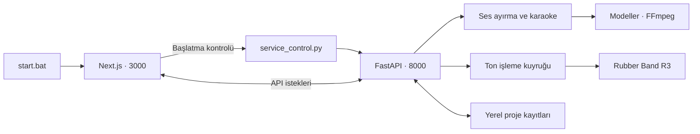

<div align="center">

# 🎧 UVR5 Next Studio

### Sesini ayır. Sözlerini eşleştir. Müziğini düzenle.

**Yapay zekâ destekli ses ayırma, karaoke senkronizasyonu ve transpoze için yerel müzik stüdyosu.**


[Hızlı başlangıç](#hızlı-başlangıç) · [Özellikler](#özellikler) · [Kurulum](#kurulum) · [Kullanım rehberi](#kullanım-rehberi) · [Sorun giderme](#sorun-giderme)

</div>

---

## Stüdyoya genel bakış

UVR5 Next Studio; vokal ve enstrüman ayrıştırmayı, kelime düzeyinde karaoke düzenlemeyi, perde/tempo kontrolünü ve video çıktısını aynı arayüzde birleştirir. Ses işleme görevleri bilgisayarınızdaki Python sunucusunda yürütülür; Next.js arayüzü tarayıcı üzerinden kullanılır.

Proje **kişisel, yerel kullanım** için geliştirilmiştir. Tek Windows başlatıcısı `start.bat` dosyasıdır. Eski Gradio arayüzü, HTML şablonları ve alternatif başlatıcılar kaldırılmıştır.

> [!IMPORTANT]
> GitHub deposu kaynak kodu içerir. Python ortamı, npm bağımlılıkları, büyük modeller, indirilen sesler ve kişisel proje kayıtları depoya yüklenmez. İlk kurulum için `setup.bat` kullanılır; hazır kurulu klasörünüz varsa doğrudan `start.bat` ile başlayabilirsiniz.

## Hızlı başlangıç

**Daha önce hazırlanmış çalışma klasörünü kullanıyorsanız:**

1. Proje kökündeki **`start.bat`** dosyasını açın.
2. Sunucunun ve arayüzün hazırlanmasını bekleyin.
3. Tarayıcı otomatik açılmazsa **[localhost:3000](http://localhost:3000)** adresine gidin.
4. Bir ses dosyası yükleyin, model seçin ve ayrıştırmayı başlatın.
5. Oluşan kanallardan söz düzenleyicisini, karaoke araçlarını veya perde/tempo panelini açın.

| Bileşen | Adres / dosya | Görevi |
| :--- | :--- | :--- |
| Stüdyo | `http://localhost:3000` | Next.js kullanıcı arayüzü |
| Ses sunucusu | `http://localhost:8000` | FastAPI ve ses işleme görevleri |
| API belgeleri | `http://localhost:8000/docs` | Geliştiriciler için uç noktalar |
| Başlatıcı | `start.bat` | Ön yüzü başlatır; ön yüz başlatma adımı API’yi hazırlar |
| Sunucu günlüğü | `logs/backend.log` | Başlatma ve işlem hataları |

## Özellikler

| Alan | Sunulan araçlar |
| :--- | :--- |
| **Ses ayırma** | Roformer, MDX23C, MDX-NET, VR Arch ve Demucs model aileleri |
| **Model yönetimi** | Model listesi, indirme durumu, favoriler ve aramalı seçim kutuları |
| **Çoklu model** | Ensemble işlemleri ve Master Studio Pro gibi hazır yapılandırmalar |
| **Karaoke** | Otomatik söz çıkarma, satır/kelime zamanları, canlı senkron ve referans söz karşılaştırması |
| **Ses parçaları** | Aralık dinleme, parça ekleme, bölme, birleştirme ve kelimelere bağlama |
| **Transpoze** | Kaynak tona göre hedef nota gösterimi, −12 ile +12 yarım ton ve bağımsız tempo |
| **Oynatma** | Dalga formu, ses seviyesi, kanal dinleme ve karşılaştırma araçları |
| **Restorasyon** | Yankı/kalıntı temizleme ve uygun bağımlılıklarla AudioSR destekli iyileştirme |
| **Video** | Karaoke videosu ve dalga formu görselleştirmesi dışa aktarma |
| **Projeler** | Yerel kütüphane, disk üzerinde kayıt, satır kilidi ve geri al/ileri al geçmişi |
| **İşlem merkezi** | Ton işleme kuyruğu, iptal, yeniden deneme ve önbellek temizliği |

Model kalitesi ve işlem süresi; kaydın yapısına, seçilen modele, işlem ayarlarına ve donanıma bağlıdır. Otomatik söz ve zaman önerileri düzenlenebilir; özellikle üst üste binen vokallerin dinlenerek kontrol edilmesi gerekir.

## Kurulum

### Tek dosyayla otomatik kurulum

1. Depoyu klonlayın veya GitHub'dan ZIP olarak indirip **tamamen bir klasöre çıkarın**.
2. Uygulama açıksa arayüzdeki **Kapat** düğmesiyle kapatın.
3. Proje kökündeki **`setup.bat`** dosyasına çift tıklayın.
4. Kurulum ve model indirme adımlarının tamamlanmasını bekleyin.
5. **“Kurulum tamamlandı”** mesajından sonra **`start.bat`** dosyasını açın.

```powershell
git clone https://github.com/seghobs/uvr5mscnew.git
cd uvr5mscnew
.\setup.bat
# Kurulum bittikten sonra:
.\start.bat
```

> [!IMPORTANT]
> **`setup.bat` kurar; `start.bat` çalıştırır.** Kurulum betiği web uygulamasını başlatmaz. Kurulum başarısız olursa başarı mesajı vermez; hata adımını ve `logs/setup.log` dosyasını gösterir.

### Otomatik olarak neler hazırlanır?

| Adım | Yapılan işlem |
| :--- | :--- |
| **Ön kontrol** | Windows x64, proje dosyaları, boş alan, açık uygulama ve eşzamanlı kurulum kontrolü |
| **Python** | Eksikse doğrulanmış Miniforge kurulumu üzerinden proje içinde Python 3.10 ortamı |
| **Node.js / npm** | Uygun kurulum yoksa proje ortamına Node.js 22 ve npm |
| **FFmpeg / FFprobe** | Araçlar eksikse SHA256 doğrulamalı taşınabilir Windows dağıtımı |
| **Ses bağımlılıkları** | Birbiriyle eşleşen Torch/Torchaudio/Torchvision, ayırma, Whisper, Türkçe hizalama ve AudioSR paketleri |
| **Web arayüzü** | `npm ci` ile kilit dosyasına uygun kurulum ve `npm run build` ile derleme |
| **Başlangıç modelleri** | BS-Roformer-Viperx-1297, Whisper large-v3, large-v3-turbo ve Türkçe CTC hizalama modeli |
| **Son kontrol** | Python paketleri, kısa bir ses üzerinde gerçek transpoze testi, Next.js/React/TypeScript ve FFmpeg/FFprobe |

Diğer ayırma modelleri, çoklu model hazır ayarlarının ek modelleri ve bazı restorasyon ağırlıkları ihtiyaç duyulduğunda uygulama üzerinden indirilir. Kurulum bütün model kataloğunu indirmez.

### Donanım ve bağlantı

| Gereksinim | Açıklama |
| :--- | :--- |
| **Windows x64** | Otomatik betik Windows için hazırlanmıştır; ARM64 ve diğer işletim sistemleri bu kurulum akışının dışındadır. |
| **İnternet** | Araçlar, Python/npm paketleri ve başlangıç modelleri için gereklidir. |
| **Disk** | Betik en az 20 GB boş alan kontrolü yapar. Paket önbellekleri ve sonraki modeller için daha fazla alan gerekebilir. |
| **Node.js** | Next.js'in alt sınırı 20.9.0'dır; otomatik kurulum 22 veya üstünü kabul eder, gerekirse 22 kurar. |
| **Python** | Proje içinde Python 3.10 kullanılır. `env/python.exe` beklenir. |
| **GPU** | Uygun NVIDIA sürücüsünde CUDA 12.8 paketleri seçilir; uygun sürücü bulunmazsa CPU paketleri kurulur. |

GPU sürücüsü bu betik tarafından kurulmaz veya değiştirilmez. Donanımın seçilen modele uygunluğu, kullanılabilir RAM/VRAM ve işlem süresi bilgisayarınıza bağlıdır. CPU yolu bütün ağır modeller için aynı hız veya kapasiteyi sağlamaz.

Kurulum araçları sistem `PATH` ayarını kalıcı olarak değiştirmez. `start.bat`, proje içindeki araçları kendi çalıştırma ortamına ekler. Windows yönetici izni gerektirmeyen proje içi kurulum tercih edilir; güvenlik yazılımı veya kurum politikası indirmeleri engelliyorsa bu engel ayrıca çözülmelidir.

### Tekrar çalıştırma ve mevcut ortam

- Mevcut `env/` ortamı, sesler ve proje kayıtları otomatik silinmez.
- Mevcut Python sürümü uyumsuzsa ortamı silmek yerine kurulum durur ve hata bildirir.
- `npm ci`, ön yüz bağımlılıklarını yeniden kurar; uygulama bu sırada kapalı olmalıdır.
- Yarım kalan ağ adımları yeniden denenir. Sorun çözülünce `setup.bat` tekrar açılabilir.
- Model indirmelerinde tamamlanmış dosyalar veya indirme önbelleği tekrar kullanılır.
- Büyük model indirmeleri bağlantıya göre uzun sürebilir; sabit tamamlanma süresi verilmez.

> [!NOTE]
> AudioSR 0.0.7'nin eski NumPy, Librosa ve Transformers sınırları ayırma motoruyla çakışır. Kurulum yardımcısı yalnız bu üç eski sınırı ayırarak uygulamada kullanılan modern sürümleri kurar ve AudioSR'yi gerçekten içe aktararak kontrol eder. GPU ONNX ile CPU ONNX paketlerinin aynı DLL dosyalarını ezmesi de önlenir. Bu nedenle yalnız `pip install -r requirements.txt` komutu otomatik kurulumun bütün adımlarına eşdeğer değildir.

### Yalnızca kurulum kontrolü

Paket kurmadan veya modelleri indirmeden mevcut ortamı kontrol etmek için proje kökünde:

```powershell
powershell.exe -NoProfile -ExecutionPolicy Bypass -File scripts/setup.ps1 -VerifyOnly
```

Geliştiriciler model indirme aşamasını `-SkipModels` ile atlayabilir. Normal `setup.bat` kullanımı bu aşamayı atlamaz.

Kurulum doğrulamasında Miniforge ve FFmpeg/FFprobe indirme-kurulum adımları, başlangıç modelleri, mevcut ortamda gerçek transpoze, temiz ortam bağımlılık çözümlemesi ve ön yüz derlemesi kontrol edildi. Baştan sona kurulum, ayrı bir temiz Windows sanal makinesinde henüz denenmedi.

İndirilen Miniforge ve FFmpeg araçları `tools/setup-runtime/` altında tutulur; bu klasör Git'e gönderilmez. İndirme kaynağı ve SHA256 değerleri kurulum yardımcılarında sabittir. Kaynaklar: [Miniforge](https://github.com/conda-forge/miniforge), [FFmpeg Windows dağıtımı](https://www.gyan.dev/ffmpeg/builds/) ve [PyTorch sürüm tablosu](https://docs.pytorch.org/get-started/previous-versions/).

## Kullanım rehberi

### Ses yükleme ve ayırma

1. Dosyanızı yükleyin veya desteklenen çevrim içi kaynaklar için arama/bağlantı alanını kullanın.
2. Bir model ailesi ve o aileye ait model seçin.
3. Çıktı biçimini ve gerekli ayırma parametrelerini belirleyin.
4. Ayrıştırmayı başlatın; oluşan kanalları dalga formu oynatıcılarından dinleyin.
5. İlgili kanalda karaoke, restorasyon, karşılaştırma veya transpoze araçlarına geçin.

Çoklu model işlemleri birden fazla modelin sonuçlarını birleştirir. **Master Studio Pro** dört model kullanır; vokal ve enstrüman sonuçlarına farklı ağırlıklar uygular. Güncel model listesi ve ağırlıklar [hazır yapılandırma dosyasında](frontend/src/lib/studio-pro-preset.json) tutulur.

### Karaoke ve söz düzenleme

Karaoke düzenleyicisi, otomatik çözümleme ile elle düzeltmeyi birlikte kullanır:

- Sözleri sesten çıkarın veya mevcut metni düzenleyin.
- Satırları ve kelimeleri ayrı ayrı dinleyerek zamanlarını kontrol edin.
- Ses parçalarını ilgili kelimelere sürükleyin; dokunmatik kullanımda parça ve kelimeyi seçin.
- Birleşik algılanan ses parçasını bölme noktasından ayırıp yeni parçaları kelimelere bağlayın.
- Eksik veya belirsiz önerileri dinleyerek düzeltin.
- Düzenlemesi tamamlanan satırları **kilitleyin**.

> [!TIP]
> Seste “bile cayabilirim” tek parça olarak gelirse ses parçasını uygun noktadan bölün. Ardından iki parçayı ilgili kelimelere ayrı ayrı bağlayın. Bağlantıların ve boşlukların doğruluğunu kısa aralık dinlemeleriyle kontrol edin.

### Canlı senkron ve kısayollar

| İşlem | Davranış |
| :--- | :--- |
| **Space** | Canlı senkron açıkken seçili satırın zamanını işaretleme/ilerleme akışını yönetir. |
| **Space basılı tutma** | Basılı tutarak aralık kaydı yapar; otomatik tuş tekrarı birden fazla satır atlatmaz. |
| **Enter** | Canlı senkronu kapatır, bekleyen yakalamayı iptal eder ve oynatmayı durdurur. |
| **Son satırın tamamlanması** | Senkron son satırda biter; tekrar Space basılması üst satıra dönmez. |
| **Ctrl + Z** | Metin alanı dışında düzenleme geçmişinde geri alır. |
| **Ctrl + Y / Ctrl + Shift + Z** | Metin alanı dışında ileri alır. |

Canlı senkron sırasında daha önce kelime bağlantısı yapılmış satırların zamanları otomatik olarak sıfırlanmaz. Kilitli satırlar otomatik düzenlemelere karşı korunur. Bilinçli bir değişiklik yapmak için ilgili kilidi açın veya ilgili bağlantıyı düzenleyin.

Metin alanında yazarken tarayıcının metin düzenleme kısayolları geçerlidir. Canlı senkron açıkken Space ve Enter senkron işlevi görür; normal yazmaya dönmek için önce canlı senkronu kapatın.

### Ton ve tempo

Perde ve Tempo Düzenleyici iki ayrı kontrol sunar:

| Kontrol | Aralık | Etkisi |
| :--- | :--- | :--- |
| **Perde** | −12 … +12 yarım ton | Hedef notayı değiştirir; seçilen tempoyu korur. |
| **Tempo** | 0.5× … 2× | Oynatma/işleme hızını değiştirir; seçilen perdeyi korumayı amaçlar. |
| **Kaynak ton** | Analiz sonucu veya elle seçim | Hedef nota etiketlerinin hangi temel nota üzerinden hesaplanacağını belirler. |
| **Sıfırla** | Orijinal ayarlar | Perdeyi ve tempoyu başlangıç değerlerine döndürür. |

Örneğin kaynak ton **La minör** ise **+2 yarım ton**, **Si minör** olarak gösterilir. Tempo **1×** kaldığında transpoze işlemi şarkının süresini değiştirmez. Kaynak ton analizinin yanlış olduğunu düşünüyorsanız elle düzeltin; bu seçim sesin kendisini yeniden analiz etmez.

İşleme motoru **Rubber Band R3** kullanır. Ses, kaynak dosyadan işlenir; formant koruma ve stereo merkez odağı etkinleştirilir. Önizleme kayan noktalı WAV, transpoze dışa aktarımı 24 bit FLAC olarak hazırlanır. Büyük ton kaydırmalarında veya karmaşık mikslerde duyulabilir işleme etkileri olabilir; dışa aktarmadan önce dinleyin.

### Yerel çalışma merkezi

Panelden ton önizleme ve transpoze dışa aktarma işlerini takip edebilirsiniz:

- Sıradaki ve çalışan işleri görüntüleme.
- Aktif ton işlerini iptal etme.
- Başarısız, iptal edilmiş veya yarıda kalmış işleri yeniden deneme.
- Tamamlanan dışa aktarma dosyasını indirme.
- Önbelleği ve bitmiş işlem geçmişini temizleme.
- Kayıt durumunu görme ve sunucuyu yeniden başlatma.

İptal mekanizması ton önizleme ve transpoze dışa aktarma kuyruğunu kapsar. Panelde gösterilen diğer GPU ayırma görevleri için aynı iptal desteği varsayılmamalıdır. Aktif işlem varken sunucuyu yeniden başlatma ve toplu çalışma temizliği reddedilir.

## Kayıt, yedekleme ve temizlik

### Veriler nerede tutulur?

| Konum | İçerik | Yedekleme durumu |
| :--- | :--- | :--- |
| `projects/` | Kütüphane, kanal ayarları, söz taslakları, bağlantılar ve düzenleme geçmişi | Çalışmalar için saklayın. |
| `assets/favorites.db` | Aktif SQLite veritabanı; favoriler ve söz kayıtları | Çalışmalarla birlikte saklayın. |
| `outputs/` | Ayrılmış kanallar ve oluşturulan çıktılar | Projenin kullandığı dosyaları saklayın. |
| `uploads/`, `ytdl/` | Yüklenen ve indirilen kaynak dosyalar | Kaynak seslere tekrar ihtiyaç duyacaksanız saklayın. |
| `models/` | İndirilmiş model ağırlıkları | Yeniden indirmeyi önlemek için saklanabilir. |
| `cache/` | Yeniden üretilebilen ton önizlemeleri ve işlem durumu | Çalışma dosyalarının yerine geçmez. |
| `logs/` | Çalışma günlükleri | Sorun incelemek için kullanılır. |

Büyük proje kayıtları yalnızca tarayıcı depolamasına dayanmaz; sunucu üzerinden diske yazılır. Sunucuya henüz ulaşmamış değişiklikler tarayıcıdaki IndexedDB kuyruğunda tutulur. Panelde **“Projeler diskte”** durumunu görmeden tarayıcı verilerini temizlemeyin.

Dosya güncellemelerinde atomik değiştirme ve bir önceki sürümün saklanması kullanılır. Geri al/ileri al geçmişi sınırlıdır; sınırsız bir yedekleme sistemi değildir.

> [!IMPORTANT]
> `.uvrproj` dışa aktarımı kütüphane öğesini ve ayarlarını taşır; ses dosyalarının ve bütün disk kayıtlarının tek dosyalık tam yedeği değildir. Tam yedek için uygulamadaki kayıtları tamamlayın, uygulamayı kapatın ve ilgili klasörleri birlikte kopyalayın.

### Hangi temizlik neyi siler?

| İşlem | Sildiği / boşalttığı içerik |
| :--- | :--- |
| **Önbelleği ve geçmişi temizle** | Yeniden üretilebilir ton önizlemeleri ve bitmiş işlem satırları. Aktif işler korunur. |
| **VRAM Boşalt** | Bellekteki modelleri GPU/RAM’den boşaltır; indirilen model dosyalarını silmez. |
| **Tüm Çalışmaları & İndirmeleri Temizle** | Çalışma çıktıları, yüklenen/indirilen dosyalar, söz kayıtları ve ilgili proje durumları. |

> [!WARNING]
> **“Evet, Hepsini Sil” çalışma verilerini siler.** Bu işlem önbellek temizliğiyle aynı değildir. Gerekli ses ve proje kayıtlarını önceden yedekleyin.

Ton önbelleği **2 GB**, **32 dosya** ve **7 günlük yaş sınırı** ile temizlenir. Kaynak ses değişirse eski önizleme farklı içerik için tekrar kullanılmaz.

## Mimari ve klasör yapısı



```text
uvr5mscnew/
├── setup.bat                  # Otomatik kurulum
├── start.bat                  # Windows başlatıcısı
├── scripts/                   # Kurulum ve doğrulama yardımcıları
├── api_modern.py              # FastAPI uç noktaları
├── service_control.py         # Projeye ait servislerin yönetimi
├── core.py                    # Ses ayırma ve restorasyon
├── studio_pro.py              # Çoklu model işleme
├── audio_jobs.py              # Kuyruk, iptal ve önbellek
├── audio_pitch.py             # Ton/tempo işleme
├── karaoke_*.py               # Söz, hece, zamanlama ve video araçları
├── local_projects.py          # Disk üzerinde proje depolama
├── requirements.txt           # Python bağımlılıkları
├── frontend/
│   ├── src/app/               # Next.js sayfası ve genel stiller
│   ├── src/components/        # Stüdyo bileşenleri
│   ├── src/lib/               # API, kayıt ve düzenleme mantığı
│   ├── scripts/               # API kontrolü ve tarayıcı başlatma
│   ├── package.json
│   └── package-lock.json
├── assets/                    # Yapılandırma ve model listesi
├── tools/rubberband/          # Windows ses aracı ve lisansları
├── tests/                     # Otomatik testler
└── README.md
```

`env/`, `frontend/node_modules/`, `models/`, `projects/`, ses klasörleri, önbellek ve günlükler kurulum veya kullanım sırasında oluşur; büyük ve kişisel içerikleri Git’e gönderilmez.

### Yerel kullanım sınırları

Ses işleme bilgisayarınızda yapılır. Bununla birlikte model indirme, çevrim içi medya/söz arama ve arayüzdeki bazı dış kaynaklar internet kullanabilir; uygulama her koşulda tamamen çevrim dışı değildir.

Sunucu yapılandırması yerel kullanım içindir; mevcut API `0.0.0.0:8000` üzerinde dinler ve geniş CORS ayarına sahiptir. Bu depo kimlik doğrulamalı bir genel internet servisi olarak hazırlanmış değildir. Yerel kullanım için port yönlendirmesi gerekmez.

## Geliştirme ve doğrulama

### Ön yüz

Komutları `frontend/` klasöründe çalıştırın:

```powershell
npm run dev
npm run typecheck
npm run lint
```

`npm run dev`, API kontrolünü yapan `predev` adımını da çalıştırır. Üretim derlemesini denemek için açık geliştirme sürecini kapatıp aynı klasörde `npm run build` kullanabilirsiniz. `npm run start` yalnızca derlenmiş ön yüzü açar; Python API’nin ayrıca çalışıyor olması gerekir.

### Python testleri

Proje kökünde:

```powershell
.\env\python.exe -m unittest discover -s tests -p 'test_*.py'
```

### Ön yüz davranış testleri

Proje kökünde:

```powershell
Get-ChildItem tests -Filter *.cjs | ForEach-Object {
    node $_.FullName
    if ($LASTEXITCODE -ne 0) {
        throw "Test başarısız: $($_.Name)"
    }
}
```

**13 Eylül 2026 doğrulaması:** 84 Python testi (7 kurulum testi dahil), 9 `.cjs` test dosyası ve TypeScript tür denetimi geçti. Bu sayı belirtilen çalıştırmaya aittir; bütün donanımlar ve bütün ses kayıtları için hatasızlık garantisi değildir. Ayrı bir geçici çalışma kopyasında Next.js üretim derlemesi de geçti. Lint bu test sonucuna dahil değildir.

Test kapsamı; kelime bağlantıları, canlı senkron, kilitli satırlar, geri alma geçmişi, kayıt kesintileri, temizlik, ton/tempo bağımsızlığı ve önbellek davranışlarını içerir. Canlı GPU testleri model kurulumu gerektirebilir ve test çıktıları üretebilir.

## Sorun giderme

<details>
<summary><strong>Başlatıcı “Python bulunamadı” diyor</strong></summary>

`env/python.exe` dosyasının mevcut olduğunu kontrol edin. Ortam yalnızca `env/Scripts/python.exe` içeriyorsa klasör düzeni mevcut Windows servis yöneticisiyle eşleşmiyordur. `setup.bat` ile proje içi ortamı hazırlayın; mevcut farklı yapıda ortamı değiştirmeden önce yedeğini alın.

</details>

<details>
<summary><strong>“npm tanınmıyor” veya Node.js sürüm hatası alıyorum</strong></summary>

`node --version` ve `npm --version` komutlarını kontrol edin. Node.js sürümü en az 20.9.0 olmalıdır. Node.js kurulumundan sonra açık terminali kapatıp yeniden açın; bağımlılıkları `frontend/` içinde `npm ci` ile kurun.

</details>

<details>
<summary><strong>Arayüz açılıyor ama sunucuya bağlanamıyor</strong></summary>

`logs/backend.log` dosyasına bakın. Python paketleri eksik olabilir veya 8000 portunu başka bir uygulama kullanıyor olabilir. Başlatıcı başka projeye ait servisi zorla kapatmaz. 3000 portundaki arayüz ile 8000 portundaki API’nin ikisini de kontrol edin.

</details>

<details>
<summary><strong>Ton önizlemesi hazırlanamıyor</strong></summary>

Kaynak sesin yerinde olduğunu, `ffmpeg -version` komutunun çalıştığını ve `tools/rubberband/` altındaki çalıştırılabilir dosyalarla DLL’nin eksik olmadığını kontrol edin. İşlem merkezindeki hata kaydını inceleyip yeniden deneyin. Önizleme hazırlanırken kısa bir bekleme normaldir.

</details>

<details>
<summary><strong>GPU belleği yetmiyor veya işlem çok yavaş</strong></summary>

Çalışan işlemlerin tamamlanmasını bekleyin. Kullanılan modele uygun şekilde batch/segment ayarlarını azaltın veya daha küçük model seçin. Gerekirse VRAM boşaltma aracını kullanın. CUDA kullanılabilirliğini kurulum bölümündeki kontrol komutuyla doğrulayın.

</details>

<details>
<summary><strong>Whisper kelimeyi yanlış anlıyor ya da parça birleşik geliyor</strong></summary>

Dil seçimini, satır metnini ve dinlenen zaman aralığını kontrol edin. Otomatik çözümleme önerisini elle düzenleyebilir, ses parçasını bölüp kelimelere ayrı ayrı bağlayabilirsiniz. Müzik, geri vokaller ve çok kısa heceler otomatik tanımayı zorlaştırabilir.

</details>

<details>
<summary><strong>Bir kelime sarı olmuyor</strong></summary>

Kelimenin gerçekten bağlı, geçerli başlangıç/bitiş zamanına sahip olup olmadığını ve oynatmanın bu aralıkta bulunduğunu kontrol edin. Yalnızca satır zamanının olması her kelimenin ayrı hizalandığı anlamına gelmez. İlgili parçayı dinleyip kelime bağlantısını doğrulayın.

</details>

<details>
<summary><strong>“Kayıt bekliyor” görünüyor</strong></summary>

API bağlantısını kontrol edin ve panelde yeniden deneyin. Bekleyen değişiklikler tarayıcı kuyruğunda olabilir; kayıt tamamlanana kadar tarayıcı verilerini temizlemeyin. Normal kapanış ve yeniden başlatma akışı bekleyen kayıtları tamamlamayı dener.

</details>

<details>
<summary><strong>Önbelleği temizledim ama aktif işlem hâlâ görünüyor</strong></summary>

Önbellek temizliği aktif işleri kaldırmaz. Ton kuyruğundaki işi önce iptal edin; işlem durduktan sonra geçmişi temizleyin. Bu işlem çalışma seslerinizi silmek için kullanılmaz.

</details>

## Katkı ve bakım

Bir hata bildirirken uyguladığınız adımları, kullanılan model/işlem türünü ve ilgili hata mesajını paylaşın. Günlüklerde veya ekran görüntülerinde kişisel dosya yolları bulunabileceğini göz önünde bulundurun.

Kod değişikliklerinden sonra ilgili Python ve ön yüz testlerini çalıştırın. Özellikle söz kayıtlarını, satır kimliklerini, kilitleri ve ses bağlantılarını etkileyen değişikliklerde kayıt/yeniden yükleme davranışını kontrol edin.

## Köken ve lisanslar

Bu çalışma [UVR5-UI](https://github.com/Eddycrack864/UVR5-UI) ve audio-separator altyapısı üzerine geliştirilmiştir. Proje kaynak kodunun lisansı [LICENSE](LICENSE) dosyasındadır.

Birlikte dağıtılan **Rubber Band** araçları kendi **GPL lisansına** tabidir. Kaynak ve dağıtım bilgileri [SOURCE.md](tools/rubberband/SOURCE.md), lisans metni [COPYING.txt](tools/rubberband/rubberband-4.0.0-gpl-executable-windows/COPYING.txt) dosyasındadır. Model ağırlıkları ve üçüncü taraf bağımlılıklar da kendi lisans koşullarına sahiptir.

---

<div align="center">

**UVR5 Next Studio** · Yerel çalışma · Düzenlenebilir zamanlama · Kaynak dosyadan ses işleme

[Depoya dön](https://github.com/seghobs/uvr5mscnew) · [Yerel stüdyo notları](LOCAL_STUDIO_CHANGES.md) · [Yukarı çık](#-uvr5-next-studio)

</div>
