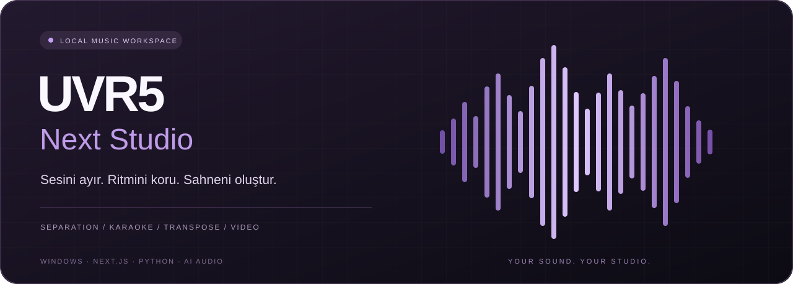
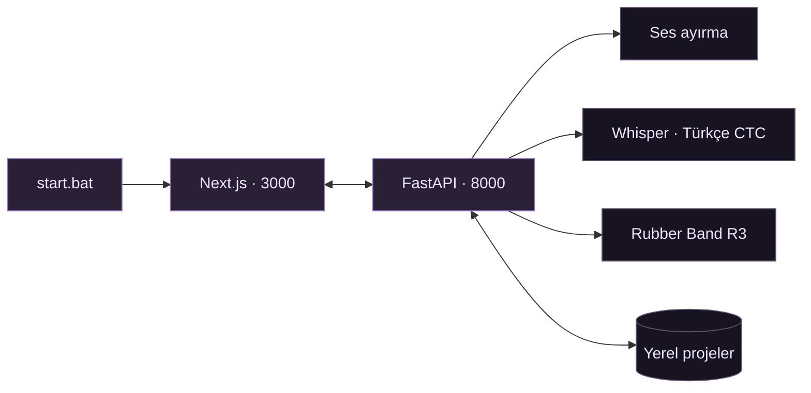

<a id="top"></a>

<div align="center">



**Bir kayıttan, kendi müzik stüdyona.**

Vokal ayırma · Kelime düzeyinde karaoke · Bağımsız ton ve tempo · Video üretimi


[**Başla**](#basla) &nbsp; / &nbsp; [**Stüdyoyu keşfet**](#studyo) &nbsp; / &nbsp; [**Karaoke**](#karaoke) &nbsp; / &nbsp; [**Kullanım rehberi**](KULLANIM_REHBERI.md)

</div>

---

UVR5 Next Studio, bir ses kaydını ayrılmış kanallara, düzenlenebilir sözlere ve karaoke videosuna dönüştüren **Windows için yerel müzik çalışma alanıdır**. Arayüz tarayıcıda açılır; ses ayırma, hizalama ve transpoze işlemleri bilgisayarındaki Python sunucusunda çalışır.

<table>
<tr>
<td width="33%" valign="top">

### 01 · Sesini ayır

Vokali ve enstrümanı ayrı kanallara çıkar. Modelini seç, ensemble hazır ayarlarını kullan, sonucu dalga formunda dinle.

**Roformer · MDX · VR Arch · Demucs**

</td>
<td width="33%" valign="top">

### 02 · Sözlerine hayat ver

Sözleri bul, düzenle ve sesle eşleştir. Kelimeleri dinle; renk dolmasını kontrol ederek senkronu tamamla.

**Whisper · Türkçe CTC · Canlı senkron**

</td>
<td width="33%" valign="top">

### 03 · Çıktını oluştur

Tonunu ve temponu ayrı ayarla. Sanatçını, başlığını ve etiketini ekle; sesini veya videonu dışa aktar.

**Rubber Band R3 · FLAC · MP4**

</td>
</tr>
</table>

<a id="basla"></a>

## Üç adımda stüdyodasın

```powershell
git clone https://github.com/seghobs/uvr5mscnew.git
cd uvr5mscnew
.\setup.bat
```

Kurulum tamamlandığında:

```powershell
.\start.bat
```

**Stüdyoyu aç → [localhost:3000](http://localhost:3000)**

| 01 · İndir | 02 · Kur | 03 · Başlat |
| :--- | :--- | :--- |
| Depoyu klonla veya ZIP’i tamamen çıkar. | `setup.bat` ile ortamı, paketleri ve başlangıç modellerini hazırla. | Sonraki açılışlarda `start.bat` kullan. |

> [!TIP]
> **`setup.bat` kurar, `start.bat` çalıştırır.** Hazır kurulu proje klasörün varsa yeniden kurulum yapman gerekmez.

| Gereksinim | Beklenen ortam |
| :--- | :--- |
| İşletim sistemi | Windows x64 |
| Depolama | Kurulumda en az 20 GB boş alan kontrolü; modeller ve çalışmalar için ek alan |
| Bağlantı | İlk kurulum, model indirme ve çevrim içi hizmetler için internet |
| İşlemci / GPU | CPU desteği; uygun NVIDIA sürücüsüyle CUDA |
| Ortam | Proje içinde Python 3.10; uygun Node.js/npm kurulumu otomatik hazırlanır |

Başlangıç modelleri kurulumla hazırlanır; diğerleri **Model Merkezi** üzerinden indirilir. Süre ve bellek ihtiyacı donanıma ve modele bağlıdır.

[Kurulum ayrıntıları →](KULLANIM_REHBERI.md#kurulum)

<a id="studyo"></a>

## Tek arayüz. Baştan sona müzik akışı.

| Araç | Ne yapabilirsin? |
| :--- | :--- |
| **Ses ayırma** | Roformer, MDX23C, MDX-NET, VR Arch ve Demucs ile vokal/enstrüman çıkarma |
| **Model Merkezi** | Arama, indirme, favorileme ve model seçimi |
| **Ensemble** | Birden fazla modeli birleştirme; Master Studio Pro gibi hazır ayarlar |
| **Kanal oynatıcıları** | Dalga formu üzerinden dinleme, konum seçme ve ses seviyesi kontrolü |
| **Karaoke stüdyosu** | Söz arama, kelime bağlantıları, canlı senkron ve video çıktısı |
| **Perde ve tempo** | −12…+12 yarım ton; bağımsız 0.5×…2× tempo |
| **Restorasyon** | Yankı/kalıntı temizleme; uygun modellerle AudioSR iyileştirmesi |
| **Yerel kütüphane** | Kayıtlı projeye dönme, düzenleme geçmişi ve satır kilitleri |
| **Çalışma merkezi** | Ton işlerini izleme, iptal, yeniden deneme ve önbellek temizliği |

<a id="karaoke"></a>

## Sadece söz yazma. Sesle buluştur.

### Bul → Düzenle → Bağla → Dinle → Render al

**Sözlerini getir.** Whisper ile sesten çıkar veya sanatçı, şarkı adı ve söz parçasıyla kaynaklarda ara. Uygun sonuç yoksa elle yapıştır. Dört senkron denemesi başarısız olursa sözler satır satır, zamanlama bekler halde eklenir.

**Her kelimeyi kontrol et.** Ses parçalarını dinle, sürükleyerek bağla veya parça ile kelimeyi sırayla seç. Bitişik algılanan parçayı bölüp iki kelimeye ayrı süreler ver. Yazdığın sözleri değiştirmeden sesle hizalayabilirsin.

**Toplu işlemi kullan.** Tam bağlanmış ve kilitli satırlar korunur. Eksikler dört denemeyle aranır; gerektiğinde aralık komşu satırların sınırları içinde genişletilir. Başarısız genişletme geri alınır. Bağlantısız, geriye sıçramış süreler güvenli bir aralık bulunabildiğinde yeniden değerlendirilir.

**Ara nağmeleri göster.** `SOLO...` satırının rengi belirlediğin başlangıç ve bitiş boyunca dolar. SOLO’nun kelime zamanını değiştirdiğinde satır süresi de güncellenir.

**Kendi başlığınla dışa aktar.** Başlık sırası **sanatçı → şarkı → etiket** şeklindedir. Örnek video dosyası:

```text
Berdan Mardini - Berfin ( Orjinal Karaoke ).mp4
```

> [!NOTE]
> Otomatik eşleşmeler her kayıtta kusursuz olmayabilir. Belirsiz kelimeler kontrol için işaretlenir; çözülemeyen kelimelere satırı tamamlamak için rastgele süre yazılmaz.

<details>
<summary><strong>⌨️ Canlı senkron kısayolları</strong></summary>

| Tuş / mod | Davranış |
| :--- | :--- |
| **Space · dokunma** | Satır sınırını işaretler, senkronu ilerletir. |
| **Space · basılı tutma** | Basılı tuttuğun aralığı kaydeder. |
| **Enter** | Canlı senkronu kapatır, bekleyen yakalamayı iptal eder ve oynatmayı durdurur. |
| **Son satır** | Tamamlandığında senkron biter; tekrar Space üst satıra döndürmez. |
| **Ctrl + Z** | Metin alanı dışında düzenlemeyi geri alır. |
| **Ctrl + Y / Ctrl + Shift + Z** | Metin alanı dışında ileri alır. |

Normal yazmaya dönmek için canlı senkronu kapat.

</details>

<details>
<summary><strong>🔎 Söz kaynakları ve isteğe bağlı yapay zekâ</strong></summary>

Söz araması **LyricsTranslate, LRCLIB, Genius, LyricFind ve Musixmatch** kaynaklarını destekler. Sonuçlar sağlayıcının erişimine bağlıdır; bazı kaynaklar anahtar veya yetki ister. [Entegrasyon notları →](lyric_sources/README.md)

Genel Ayarlar’dan Google API anahtarını kaydedebilir ve isteğe bağlı ses/söz incelemesini etkinleştirebilirsin. Gemini entegrasyonu söz metnini ve ilgili vokal bölümlerini Google’a gönderir; model erişimi ve kota gerekir.

Anahtar Git dışında tutulan `.local-settings.json` dosyasında saklanır. Depo anahtar içermez. [Yapay zekâ incelemesi →](KULLANIM_REHBERI.md#gemini-38-flash-ile-ses-ve-söz-incelemesi)

</details>

## Ton değişsin. Tempo senin seçtiğin yerde kalsın.

**Tempo 1× iken transpoze şarkının süresini değiştirmez.** Kaynak tonu analiz sonucundan alabilir veya elle belirleyebilirsin.

| Kaynak | İşlem | Sonuç |
| :--- | :--- | :--- |
| La minör | +2 yarım ton · 1× tempo | Si minör · aynı tempo |
| Seçili ton | 0 yarım ton · 0.75× tempo | Daha yavaş çalışma; seçili perde korunur |

İşleme **Rubber Band R3** ile kaynak sesten yapılır. Önizleme kayan noktalı WAV, transpoze dışa aktarımı 24 bit FLAC kullanır. Büyük ton değişimlerinde duyulabilir işleme etkileri olabilir; çıktıyı dinleyerek değerlendir.

## Çalışmaların bilgisayarında

| Konum | İçerik |
| :--- | :--- |
| `projects/` | Yerel projeler, taslaklar ve düzenleme durumları |
| `assets/favorites.db` | Söz kayıtları ve favoriler |
| `outputs/` | Ayrılmış sesler ve üretilen dosyalar |
| `uploads/` · `ytdl/` | Kaynak sesler |
| `models/` | Model ağırlıkları |
| `cache/` · `logs/` | Önbellekler ve günlükler |

Kayıt durumunda **“Projeler diskte”** mesajını kontrol et. `.uvrproj`, sesleri de içeren tam bir yedek değildir; proje, veritabanı ve ilgili ses klasörlerini birlikte sakla.

> [!WARNING]
> `uninstaller.bat`, `SIL` onayından sonra **proje klasörünün tamamını** kaldırır; çalışmalar ve modeller dahildir. Saklayacağın dosyaları önce proje dışına yedekle. [Kaldırma kapsamı →](KULLANIM_REHBERI.md#tam-kaldırma)

<details>
<summary><strong>🧹 Hangi temizlik ne yapar?</strong></summary>

- **Önbelleği ve geçmişi temizle:** Ton önizlemeleri ve bitmiş işlem geçmişi.
- **VRAM Boşalt:** Bellekteki modeller; diskteki model dosyaları korunur.
- **Tüm Çalışmaları & İndirmeleri Temizle:** Çalışma sesleri, çıktılar ve ilgili kayıtlar.
- **uninstaller.bat:** Proje klasörü ve sahipliği doğrulanabilen ilgili kayıtlar. Diğer uygulamaların sistem Python/Node kurulumları silinmez.

[Yedekleme ve temizlik →](KULLANIM_REHBERI.md#kayıt-yedekleme-ve-temizlik)

</details>

## Kaputun altında



Ses işleme yereldir. Model indirme, çevrim içi söz/medya araması ve isteğe bağlı Gemini işlemleri internet kullanır. Proje kişisel localhost kullanımı içindir; genel internete açık bir servis olarak hazırlanmış değildir.

<details>
<summary><strong>🛠️ Geliştirici komutları ve testler</strong></summary>

Proje kökünde:

```powershell
npm --prefix frontend run typecheck
.\env\python.exe -m unittest discover -s tests -p 'test_*.py'

Get-ChildItem tests -Filter *.cjs | ForEach-Object {
    node $_.FullName
    if ($LASTEXITCODE -ne 0) { throw "Test başarısız: $($_.Name)" }
}
```

**Son doğrulama · 16 Eylül 2026:** 145 Python testi, 13 JavaScript test dosyası ve TypeScript kontrolü geçti. Bu sonuç belirtilen çalıştırmaya aittir; bütün donanımlarda veya bütün şarkılarda hatasızlık garantisi değildir.

[Mimari ve klasör yapısı →](KULLANIM_REHBERI.md#mimari-ve-klasör-yapısı) · [Geliştirme rehberi →](KULLANIM_REHBERI.md#geliştirme-ve-doğrulama)

</details>

<details>
<summary><strong>💡 Bir şey yolunda gitmiyor mu?</strong></summary>

| Belirti | İlk kontrol |
| :--- | :--- |
| Arayüz açık, API yok | `logs/backend.log`; 8000 portundaki sunucu |
| Kurulum yarıda kaldı | `logs/setup.log`; hata giderildikten sonra `setup.bat` |
| Kelime renk doldurmuyor | Ses bağlantısı, kelime sınırları ve oynatma konumu |
| SOLO yanlış sürede doluyor | Başlangıç/bitiş; güncel sürümde satır ve SOLO süresi birlikte değişir |
| Ton önizlemesi hazırlanamıyor | Kaynak dosya, FFmpeg ve `tools/rubberband/` |
| Kayıt bekliyor | API bağlantısı; kayıt bitmeden tarayıcı verilerini temizleme |

[Tam sorun giderme rehberi →](KULLANIM_REHBERI.md#sorun-giderme)

</details>

## Bu stüdyonun arkasında

[UVR5-UI](https://github.com/Eddycrack864/UVR5-UI) ve audio-separator altyapısı üzerine geliştirilmiştir. Kaynak kodun lisansı [LICENSE](LICENSE) dosyasındadır. Model ağırlıkları ve bağımlılıklar kendi lisanslarına tabidir.

Rubber Band kaynak ve dağıtım bilgileri [SOURCE.md](tools/rubberband/SOURCE.md), GPL lisansı [COPYING.txt](tools/rubberband/rubberband-4.0.0-gpl-executable-windows/COPYING.txt) içindedir.

---

<div align="center">

**UVR5 NEXT STUDIO**

<sub>Kendi sesin. Kendi çalışma alanın.</sub>

[Kullanım rehberi](KULLANIM_REHBERI.md) &nbsp; · &nbsp; [Hata bildir](https://github.com/seghobs/uvr5mscnew/issues) &nbsp; · &nbsp; [Yukarı dön ↑](#top)

</div>
